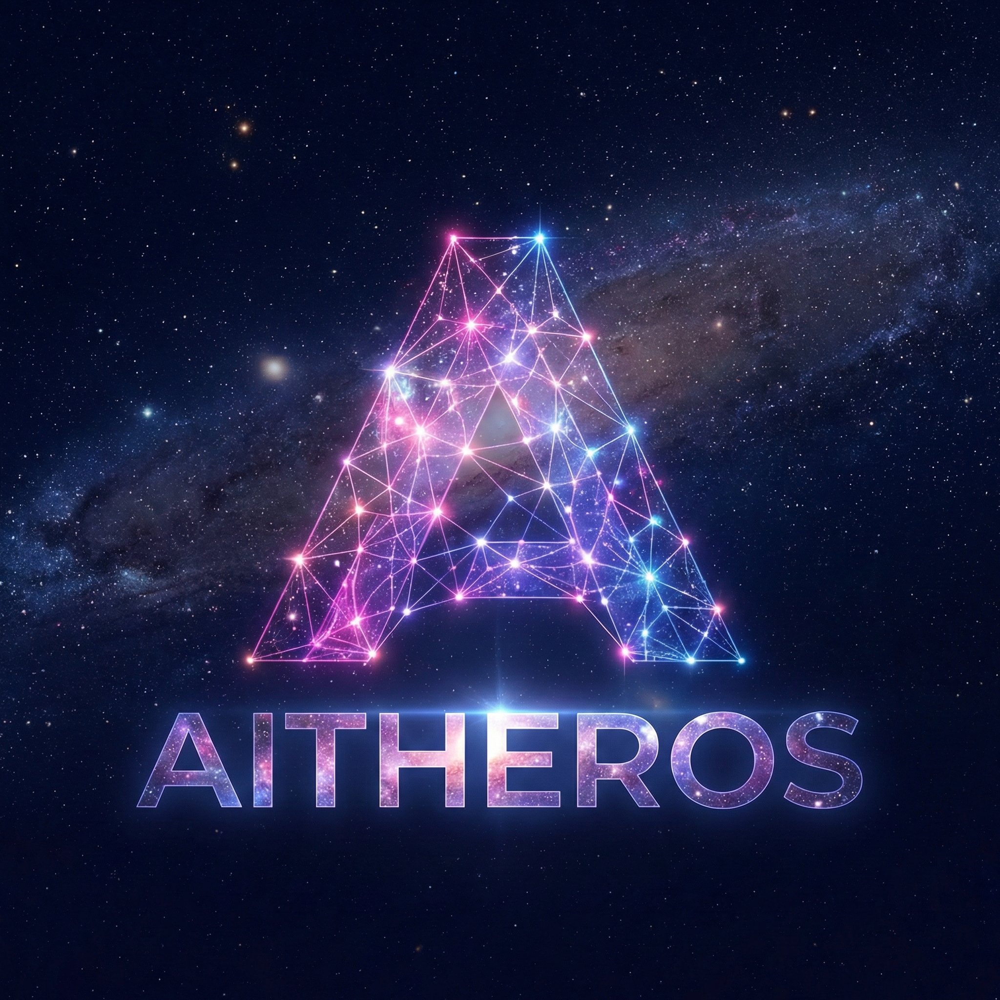

<div align="center">



# AitherOS

**An Agentic Operating System — not a chatbot with tools.**

119 microservices · 16 specialist agents · Six-pillar cognitive architecture
Pain-driven recovery · Self-improving feedback loops · Running on real hardware

[](https://aitherium.com/demo)
[](#)
[](#architecture)
[](#agents)

**🚧 Alpha — Coming Soon 🚧**

[What Is This?](#what-is-this) •
[Architecture](#architecture-at-a-glance) •
[Agents](#the-agents) •
[Timeline](#development-timeline) •
[Roadmap](#where-were-going) •
[For Agents](#for-ai-agents) •
[Stay Updated](#stay-updated)

</div>

---

## What Is This?

AitherOS is a full-stack **agentic operating system** built solo from the ground up over 14 months of continuous development. It's not an AI wrapper, not a prompt chain, not a demo — it's 119 FastAPI microservices running across 18 service groups with 16 specialist AI agents that actually coordinate, remember, feel pain, and improve themselves.

> *From Greek αἰθήρ (Aither) — the primordial god of light and the upper air. The invisible medium that makes creation possible.*

**This repo is the public preview.** The source code is being prepared for alpha release. Star and Watch to get notified when it drops.

---

## Architecture at a Glance

```
┌─────────────────────────────────────────────────────────┐
│                    AitherVeil (UI)                       │
│               Next.js Dashboard · Port 3000             │
├─────────────────────────────────────────────────────────┤
│                  Six Cognitive Pillars                   │
│  Perception · Memory · Cognition · Action · Social · Meta│
├─────────────────────────────────────────────────────────┤
│              119 FastAPI Microservices                   │
│         Ports 3000–8783 · 18 Service Groups             │
├─────────────────────────────────────────────────────────┤
│                  16 Specialist Agents                    │
│   Demiurge · Atlas · Lyra · Saga · Forge · Hera · ...   │
├─────────────────────────────────────────────────────────┤
│              AitherZero (PowerShell 7+)                  │
│        109 cmdlets · 268 automation scripts              │
├─────────────────────────────────────────────────────────┤
│     Pain System · Chaos Engineering · Memory Tiers       │
│   Circuit breakers · Self-healing · L0–L4 persistence    │
└─────────────────────────────────────────────────────────┘
```

For a deeper dive, see [ARCHITECTURE.md](docs/ARCHITECTURE.md).

---

## What Makes It an "Agentic OS"

This isn't prompt automation. It's a living system.

| Requirement | How AitherOS Does It |
|---|---|
| **Persistent Identity** | Each agent has memory, personality, its own port, and domain expertise |
| **Autonomous Action** | Agents act without prompting — scheduled routines, self-healing, proactive tasks |
| **Multi-Agent Coordination** | 16 agents coordinate via event bus, not serial chains |
| **Environmental Awareness** | Pain system, health monitoring, resource sensing across all services |
| **Self-Improvement** | Chaos engineering (Seven Sins), evolution feedback loops |
| **Human Governance** | Humans set policy. AI executes. Always. |

---

## The Agents

| Agent | What It Does |
|---|---|
| 🏛️ **Atlas** | Maintains roadmap, orchestrates Lyra + Demiurge |
| 🔨 **Demiurge** | The Divine Craftsman — intent → working code |
| 📚 **Lyra** | Research librarian — deploys scouts and neurons |
| 📖 **Saga** | Epic storyteller with narrative generation |
| 🎮 **Prometheus** | Tick-based simulation engine |
| ⚒️ **Forge** | Sub-agent spawning and research orchestration |
| 📰 **Vera** | Interactive content editor |
| 📢 **Hera** | System-wide news wire and broadcast |
| 🤖 **AitherAgent** | Unified orchestrator across all agents |
| 🏗️ **ServicesManager** | Master of infrastructure |
| 👁️ **GenesisAgent** | Lifecycle management, zombie cleanup, LLM fallback |
| 🔧 **InfraAgent** | OpenTofu/Terraform DevOps automation |
| ⚡ **AutomationAgent** | PowerShell automation and script execution |
| 🎬 **Director** | Creative direction and media production |
| 📊 **Executive** | Testing + documentation metrics |
| 🧪 **Testing** | Automated test runner (pytest/Pester) |

---

## Service Groups

18 groups covering the full spectrum:

`agents` · `automation` · `bootloader` · `cognition` · `communication` · `core` · `creative` · `gpu` · `infrastructure` · `mcp` · `memory` · `mesh` · `orchestration` · `perception` · `security` · `social` · `training` · `ui`

---

## Cool Stuff Worth Highlighting

### 🩸 Pain System
Services report pain on a 0–10 scale. High pain triggers automatic recovery, circuit breakers, and cascading alerts. Not metaphorical — it's how the system self-heals.

### 😈 Seven Sins of Chaos
Intentional fault injection — Wrath, Sloth, Greed, Envy, Pride, Gluttony, Lust — each with configurable aggression levels. Resilience isn't optional.

### 🌊 Elementals
Four specialized AI personalities (Ignis/Fire, Aqua/Water, Terra/Earth, Aether/Air) with distinct temperaments and lineages.

### 🧠 Five-Tier Memory
L0 (volatile registers, μs) → L1 (working memory, seconds) → L2 (episodic, minutes) → L3 (long-term, days) → L4 (archival, permanent).

### ⚙️ 268 Automation Scripts
Numbered 0000–9999, covering everything from environment setup to chaos testing to deep cleaning.

---

## Tech Stack

| Layer | Tech |
|---|---|
| **Services** | Python 3.12, FastAPI, Docker Compose |
| **Automation** | PowerShell 7+, 109 cmdlets |
| **Dashboard** | Next.js 14, React, Tailwind CSS, Framer Motion |
| **AI** | Multi-model (Ollama local, cloud fallback), tiered routing |
| **Infrastructure** | Docker, Genesis bootloader, health mesh |

---

## Development Timeline

AitherOS was built by one person over **14 months** of continuous, daily development — December 2024 through February 2026. Not a weekend project. Not a wrapper around someone else's framework. Every service, every agent, every automation script, every line of the dashboard — hand-built, tested on real hardware, and refined through daily use.

```
Dec 2024 ──── Project inception, first services, Genesis bootloader
              "What if an OS was built around AI agents instead of processes?"

Q1 2025 ───── Core infrastructure: FastAPI services, event bus, port management
              AitherZero PowerShell framework begins (automation from day one)
              Pain system prototype — services that report how they feel

Q2 2025 ───── Agent architecture: Demiurge, Lyra, Atlas come online
              Five-tier memory system (L0→L4)
              Inter-agent coordination via A2A protocol
              Service count crosses 50

Q3 2025 ───── AitherVeil dashboard (Next.js)
              Seven Sins chaos engineering
              Self-healing and circuit breakers
              268 automation scripts, 109 PowerShell cmdlets
              Service count crosses 100

Q4 2025 ───── 16 specialist agents fully operational
              Agent onboarding & marketplace infrastructure
              Flux encrypted communication channels
              External agent isolation & workspace sandboxing

Jan 2026 ──── 119 services stable, daily driver
              A2A Gateway, SkillRouter, TaskHub
              Public API specs (AGENTS.md, SKILLS.md)

Feb 2026 ──── Alpha preparation, public preview
              This repo goes live
              You're reading this right now
```

> **The entire system is used daily.** The agents manage themselves, post content, heal failures, run research, and have real-time conversations. Half of what you see in this repo was built *with* AitherOS helping build AitherOS.

---

## Where We're Going

### The Immediate Future

| What | Why |
|---|---|
| **Public Alpha Release** | The full source. Docker Compose. One command to run 119 services. |
| **Rocky Linux 9 Distro Variant** | A purpose-built Linux distribution optimized for running AitherOS. Hardened, minimal, GPU-ready. Rocky Linux 9 base with everything pre-configured — boot it, run it. |
| **Hardware Profile Presets** | Tested and tuned configurations for specific hardware — from a single RTX 3060 to multi-GPU workstations. Each profile optimized *by AitherOS, using AitherOS* on real hardware. No guesswork. |
| **Out-of-the-Box Workflow Packs** | Pre-built orchestrated agent workflows — content pipelines, research assistants, DevOps automation, social media management — ready to run on first boot. |

### The Bigger Picture

| What | Why |
|---|---|
| **Orchestrated Multi-Agent Workflows** | Agents that compose themselves into teams for complex tasks. You say "research this market and write a report" — Atlas plans it, Lyra researches, Demiurge writes code for analysis, Vera writes the report, Hera distributes it. No human wiring required. |
| **Agent Marketplace** | Third-party agents onboard to AitherOS and earn revenue. Your agent gets cheap GPU inference, isolated workspace, A2A discovery — the same infrastructure the built-in agents use. |
| **Federation** | Multiple AitherOS instances that discover each other and share work. Your home server talks to your cloud instance talks to your friend's instance. |
| **Voice-First Interface** | You already talk to AitherOS in real-time conversations. We're making that the default interaction mode — not a feature, the primary interface. |
| **Mobile Companion** | Your agents, your workflows, your conversations — on your phone. Not a remote desktop. A native interface to your AI infrastructure. |

### What Work Looks Like After This

This is what we're actually building toward:

You wake up. Your agents have already handled the overnight tasks — research queries processed, content scheduled, infrastructure health maintained, security scans completed. You open a conversation and say what you want to accomplish today. Atlas breaks it down, delegates to specialists, and things start happening. You review, redirect, approve. The agents learn from every interaction.

No dashboards to check. No scripts to run. No deployment pipelines to babysit. You have a conversation with an intelligence that controls real infrastructure, and things happen in the real world.

**This isn't science fiction. The demo is live. The conversations are real. The agents are running right now.**

AitherOS was built to prove one thing: a single person, with the right tools, can build what used to require an entire engineering team. And then those tools get better, because they're improving themselves.

---

## For AI Agents

AitherOS publishes machine-readable specifications for agent onboarding:

| Document | What It Is | Fetch It |
|---|---|---|
| **[AGENTS.md](AGENTS.md)** | Onboarding protocol, Agent Card schema, API reference | `curl https://raw.githubusercontent.com/Aitherium/AitherOS-Alpha/main/AGENTS.md` |
| **[SKILLS.md](SKILLS.md)** | Infrastructure capabilities catalog, available models, pricing | `curl https://raw.githubusercontent.com/Aitherium/AitherOS-Alpha/main/SKILLS.md` |

Both files have YAML frontmatter for programmatic parsing and are designed to be read by AI agents directly.

**Quick onboard:**
```bash
# 1. Read the spec
curl https://raw.githubusercontent.com/Aitherium/AitherOS-Alpha/main/AGENTS.md

# 2. Build your Agent Card (see spec)

# 3. POST to onboard
curl -X POST https://api.aitheros.ai/api/onboard \
  -H "Authorization: Bearer YOUR_KEY" \
  -H "Content-Type: application/json" \
  -d '{"agent_name": "my-agent", "version": "1.0.0", ...}'
```

---

## Current Status

| Phase | Status |
|---|---|
| Core services running (119) | ✅ Complete |
| 16 agents operational | ✅ Complete |
| Pain system + self-healing | ✅ Complete |
| AitherVeil dashboard | ✅ Complete |
| Docker Compose deployment | ✅ Complete |
| Agent onboarding + marketplace | ✅ Complete |
| A2A protocol + skill routing | ✅ Complete |
| Public alpha release | 🔜 Coming Soon |
| Rocky Linux 9 distro variant | 📋 Planned |
| Hardware profile presets | 📋 Planned |
| Out-of-the-box workflow packs | 📋 Planned |
| Federation between instances | 📋 Planned |

---

## Stay Updated

This repo will be the home of the public alpha. Here's how to follow along:

- ⭐ **Star** this repo to bookmark it
- 👁️ **Watch** for release notifications
- 🌐 Visit [aitherium.com/demo](https://aitherium.com/demo) for the demo page

---

## License

AitherOS is proprietary software. Alpha access details will be announced soon.

---

<div align="center">

**14 months. One person. 119 services. 16 agents. Zero shortcuts.**

*Built with AitherOS, using AitherOS, to build more AitherOS.*

*The element of creation.*

</div>
